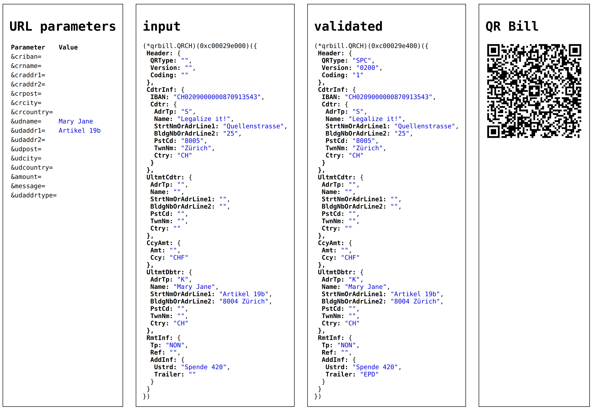

# qrbill Go package


The qrbill package implements generating QR-bill QR codes, which is a Swiss
🇨🇭 payment standard:

* [launch
announcement](https://www.six-group.com/en/newsroom/media-releases/2020/20200609-qr-bill-launch.html)

* [Specification: Swiss Implementation Guidelines
  QR-bill](https://www.paymentstandards.ch/dam/downloads/ig-qr-bill-en.pdf)
\
  (version 2.1 from 30 September 2019 at the time of writing)

These QR codes fill in details of a bank wire transfer, either all fields or
just some of them.

Recipients can scan the QR code with their mobile banking app, or with their
online banking web site’s mobile scan functionality, making it much easier to
send a wire transfer.

An example use case is for an association or club: you can send out payment
instructions to your members to collect membership fees (“Einzahlungsschein”).

## Validity

The [SIX QR-bill validation
portal](https://validation.iso-payments.ch/gp/qrrechnung/home) successfully
confirms that e.g. the code at the top right is valid.

## qrbill API (Example program)

To install the program:

```
go install github.com/stapelberg/qrbill/cmd/...
```

To run the program, run `qrbill-api` in the terminal. You will see an output like this:

```
% qrbill-api
2020/06/25 23:32:52 QR Bill generation URL: http://localhost:9933/qr?format=html
```

You can append the URL parameters on the left to customize the code. E.g.:

http://localhost:9933/qr?format=html&udname=Mary+Jane&udaddr1=Artikel+19b

When you open the URL in your web browser, you should see the following debug
output:



When you scan the resulting QR code with your eBanking app, you should see a
form like this:


Once you are happy with the code parameters, change the `format` parameter from
`html` to `png`, e.g.:

http://localhost:9933/qr?format=png&udname=Mary+Jane&udaddr1=Artikel+19b

## Crowd-sourced compatibility testing

To build confidence in our implementation, please help us verify that the codes
scan as expected!

### qrbill v0.1.3 (2020-Sep-10)

Scan each of the following 3 QR codes in your eBanking app, program or web
interface, then file an issue (or send a pull request) with your test results!
Thank you very much.

| donation | invoice | invoice without amount |
|----------|---------|------------------------|
|  |  |  |
| [donation parameters](http://localhost:9933/qr?format=html&udname=&udaddr1=&udaddr2=&udpost=&udcity=&udcountry=&udaddrtype=) | [invoice parameters](http://localhost:9933/qr?format=html&udname=Mary+Jane&udaddr1=Artikel+19b&amount=23.42) | [invoice without amount parameters](http://localhost:9933/qr?format=html&udname=Mary+Jane&udaddr1=Artikel+19b) |

| QR code                | scanned with              | paid via | Notes                                     |
|------------------------|---------------------------|----------|-------------------------------------------|
| donation               | SIX QR-bill validation    |          |                                           |
| invoice                | SIX QR-bill validation    |          |                                           |
| invoice without amount | SIX QR-bill validation    |          |                                           |
| donation               | ZKB eBanking (iOS)        | ZKB      |                                           |
| invoice                | ZKB eBanking (iOS)        |          |                                           |
| invoice without amount | ZKB eBanking (iOS)        |          |                                           |
| donation               | Revolut (iOS)             |          |                                           |
| invoice                | Revolut (iOS)             |          | message replaced with revolut text!       |
| invoice without amount | Revolut (iOS)             |          | message replaced with revolut text!       |
| donation               | Zak - Bank Cler (Android) |          | no mention of "Mary Jane" or "Artikel 19" |
| invoice                | Zak - Bank Cler (Android) |          | no mention of "Mary Jane" or "Artikel 19" |
| invoice without amount | Zak - Bank Cler (Android) |          | no mention of "Mary Jane" or "Artikel 19" |
| donation               | Bank Linth (iOS)       |          |                                     |
| invoice                | Bank Linth (iOS)       |          |                                     |
| invoice without amount | Bank Linth (iOS)       |          |                                     |
